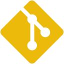

<!-- HEADER -->
<h1 align="center">
  
</h1>

<!--  ABOUT  -->

  
Nice to see you here!

  <!--  FINDME  -->
  

    <b>Find me here:</b> 
    <!--  WEBSITE  -->
    
    <!--  LINKEDIN  -->
    
  

<!--  TECH STACK  -->
<h2>Technologies:</h2>
<ul>
  <!--  FAMILIAR  -->
  <li>
    <h3>Familiar:</h3>
    <table>
      <tr>
        <td>
          <!--  VSCODE  -->
          
        </td>
        <td>
          <!--  HTML  -->
          
        </td>
        <td>
          <!--  CSS  -->
          
        </td>
        <td>
          <!--  JS  -->
          
        </td>
        <td>
          <!--  GIT  -->
          
        </td>
        <td>
          <!--  GITHUB  -->
          
        </td>
      </tr>
    </table>
  </li>
  <!--  LEARNING  -->
  <li>
    <h3>Learning:</h3>
    <table>
      <tr>
        <td>
          <!--  SASS  -->
          
        </td>
        <td>
          <!--  TS  -->
          
        </td>
        <td>
          <!--  NPM  -->
          
        </td>
        <td>
          <!--  VITE  -->
          
        </td>
        <td>
          <!--  FIGMA  -->
          
        </td>
      </tr>
    </table>
  </li>
  <!--  PLANS  -->
  <li>
    <h3>Would like to learn:</h3>
    <table>
      <tr>        
        <td>
          <!--  REACT  -->
          
        </td>        
        <td>
          <!--  WEBPACK  -->
          
        </td>
        <td>
          <!--  NODEJS  -->
          
        </td>
        <td>
          <!--  THREEJS  -->
          
        </td>        
        <td>
          <!--  PYTHON  -->
          
        </td>
        <td>
          <!--  DJANGO  -->
          
        </td>
      </tr>
    </table>
  </li>
</ul>

<!--  STATS  -->
<h2>Statistics:</h2>

  <!--  OVERALL  -->
  
  <!--  MOST USED  -->
  

<!--  FOOTER  -->
<h2></h2>

